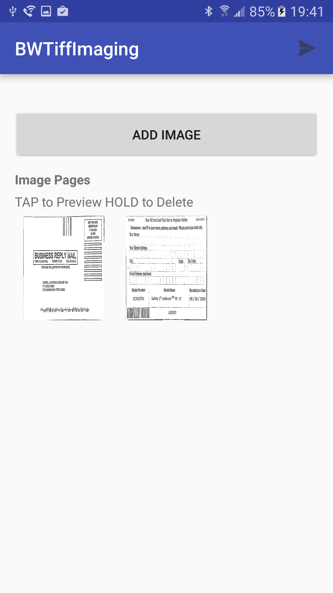
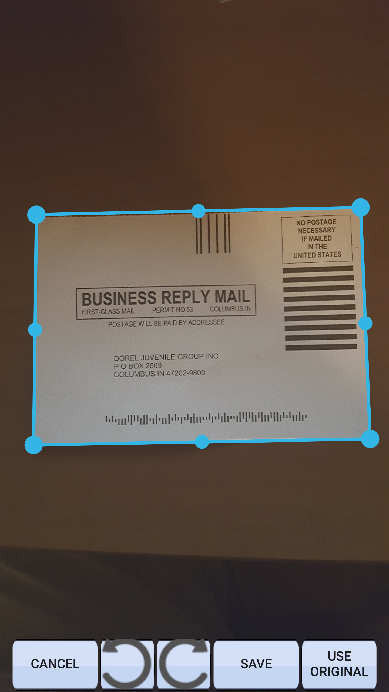
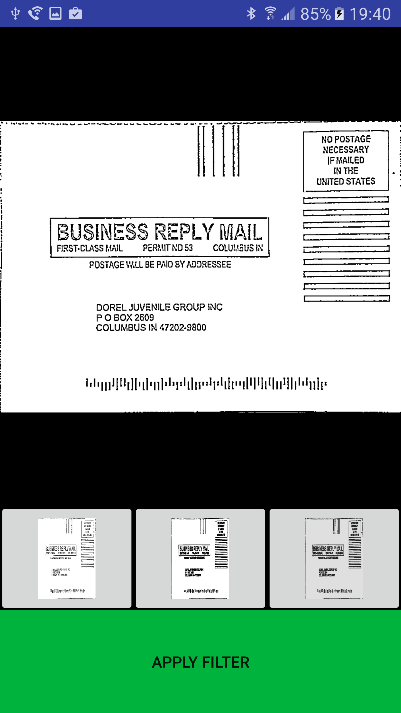
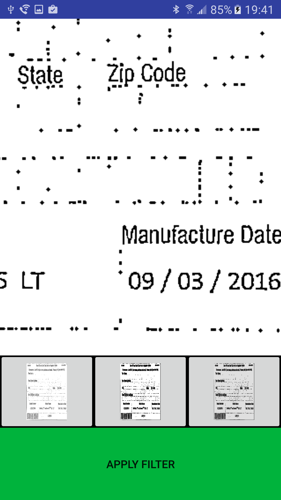

# BWTiffImaging
### Universal crop tool with rotate and deskew. Outputs BW Multipage Tiff.

---

* BWTiffImaging - Came across a real world situation where I needed a good document capture with some bells and whistles that would 
   output a decent quality, black and white multipage tiff with a decent output file size. 
   
   Status - Feature Complete, Functional. Needs bit of cleanup and do something with the output like gallery drop.
   
   
   
   Add multiple images, the output will be a Black and White tiff with Fax4 Compression.
   
   
   
   Universal crop tool with edge detection, rotation and deskew.
   
      
   
   Preview after crop with some filter options (First is best for 90% of documents)
   
    
   
   Pinch to zoom to get a detailed look.
   
   Works Cited - Tools and Libraries used:
   
   https://github.com/Beyka/Android-TiffBitmapFactory - Multipage Tiff creation
   
   https://github.com/CyberAgent/android-gpuimage     - Some filter usage
   
   opencv_java3
   
   
